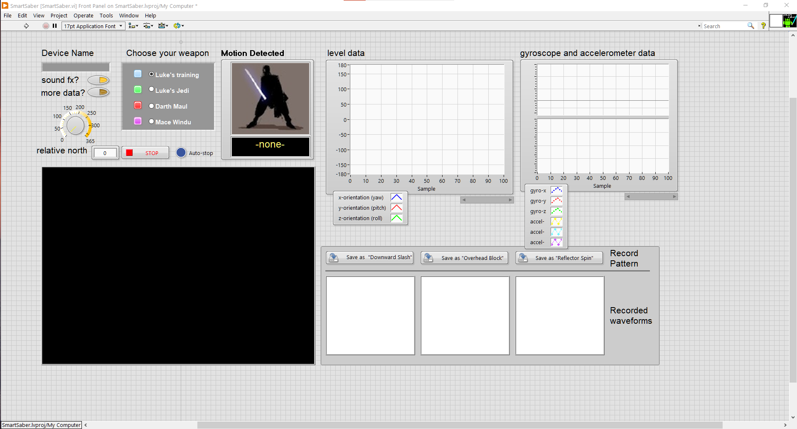

# SmartSaber

> *A LabVIEW project that virtualises hand movements captured via a smartphone's sensors, and graphically reproduces them in real time as a 3D lightsaber!* 
>
> *Basically VR before it was cool!*

A long time ago in a galaxy far far away, the final assignment for my Real Time Digital Signal Processing (RT-DSP) [Uni course](https://www.di.uoa.gr/en/studies/undergraduate/303) was to create a [LabVIEW](https://www.ni.com/en-us/shop/labview.html) project that would somehow -you guessed it- capture, process and *visualise* digital signals produced in real time. 

Going through the Star Wars phase at the time, the idea was to somehow animate a  lightsaber in 3D space that would mirror one's hand movements. How? Using a smartphone, by running motion-capturing apps that would send the data to a computer to get 3D-rendered. 

Lo and behold:

==**TODO** insert video== 

In 2022 I decided to revive this gem, and open-source it to share the fun! 

The original final deliverable for the 2016 assignment can be found in the [RT-DSP Project Spec.pdf](RT-DSP Project Spec.pdf) doc but it's in ​Gr​ee​k :greece:,  so you can find most of it's content in the following sections :gb:.

You can start practicing the Jedi tradecraft in your dojo, by following the [step-by-step guide](#Usage Instructions). 

## Features

The main feature of SmartSaber is to collect hand movement data (elevation, rotation, acceleration etc.) from the sensors on the smartphone and depict it graphically in real time, by animating a 3D model of a lightsaber.

Schematically:

Additionally, some extra features have been implemented:

* **Lightsaber Switch On/Off**

  by tapping the device's proximity sensor to enable / disable the light beam

* **Lightsaber Customisation**

  Allowing the user to choose their weapon, from a set of four iconic options:

  * Luke's Training Lightsaber
  * Luke's Jedi Lightsaber
  * Darth Maul's Lightsaber
  * Mace Windu's Lightsaber

* **Attack Training through "Learn and Detect"**

  First, the Jedi Master records (or imports) three specific lightsaber moves which the instrument will "learn". 

  Then, when the young padawan successfully replays any of them, the instrument will "reward" them by playing a distinct sound effect for each move.  

  | Downward Slash                           | Overhead Block                           | Reflector Spin                           |
  | ---------------------------------------- | ---------------------------------------- | ---------------------------------------- |
  |  |  |  |

  

## Usage Instructions

1. Download and Install LabVIEW ... Demo / online etc.

2. Clone this repo

3. Double-click the `src/SmartSaber.vi` file

   it should open in LabVIEW showing you this screen:

   

## How it works

### LabVIEW: A whistle-stop tour

**L**aboratory **V**irtual **I**nstrument **E**ngineering **W**orkbench, in short "LabVIEW" is a platform distributed by [National Instruments](https://ni.com/) (NI) which allows engineers to develop applications for data-acquisition, instrument control, industrial automation and other purposes. It runs on Windows, Linux, macOS, and even on the [cloud](https://lumen.ni.com/nicif/US/EVALLVONLINE/content.xhtml)! and is highly extensible. 

LabVIEW apps are called Virtual Instruments (VIs) and are written in "G", a visual programming language. A VI, such as a simple Thermometer, consists of 2 basic components:

1. The **Block Diagram** where the developer "codes" the data-flow by arranging things like wires, gates and functions. For our thermometer app, it would look like this: 

   

   > Looks easy? Take a look at the block diagram of the SmartSaber VI, consisting of 13 custom subVIs. You'll find it [here](exports/justBlockDiagram/SmartSaberd.png). 

2. The **Front Panel** where the end-user interacts with the final "instrument" using things like dials, knobs, switches and text input fields. For our simple thermometer, it looks something like this:

   

### SmartSaber Components

On a high level, our project consists of the following components:

* A **smartphone**, collecting sensor data and sending them to the computer through the **apps** below:

  * AndroView Free - communicating over Bluetooth
  * Sensor Network for LabVIEW - communicating over WiFi

* A computer running the VI in **LabVIEW**, receiving data in real time and rendering the animated lightsaber

  ==TODO dl and link app Vis==

In detail, here's what was used for a working setup, both originally and for the reboot 

| Smartphone (2016) - LG Google Nexus 5                        | Computer (2016) - HP Pavilion dv7 2030ev |
| ------------------------------------------------------------ | ---------------------------------------- |
| OS: Android 6.0 "Marshmallow"                                | OS: Windows XP (32-bit)                  |
| Bluetooth: 4.0                                               | Bluetooth: 4.0                           |
| WiFi: 802.11 a/b/g/n/ac                                      | WiFi: 802.11 b/g                         |
| USB port: micro 2.0                                          | CPU: Intel Core 2 Duo 2.40 GHz           |
| Sensors: InvenSense MPU 6515 / Parallax QTI / Avago APDS 9930 | Memory: 2 GB                             |
| "AndroView Free" version 2.4.1, downloaded from [Play Store](https://play.google.com/store/apps/details?id=com.heightdev.androviewbluetooth) 1 | Graphics Card: AMD Radeon HD 4650        |
| "Sensor Network for LabVIEW" version 1.1.2, downloaded from [Play Store](https://play.google.com/store/apps/details?id=com.heightdev.androviewbluetooth) 1 | LabVIEW version: 8.5                     |

[^1]: Application no longer available

| Smartphone (2022) - Google Pixel 2                           | Computer (2022) - Dell Precision M4600        |
| ------------------------------------------------------------ | --------------------------------------------- |
| OS: Android 11.0 "Red Velvet Cake"                           | OS: Windows 10 Pro (64-bit)                   |
| Bluetooth: 5.0                                               | Bluetooth: 4.0                                |
| WiFi: 802.11 a/b/g/n/ac                                      | WiFi: 802.11n                                 |
| USB port: micro 3.1, Type-C                                  | CPU: Intel Core i7 2.80 GHz                   |
| Sensors: OEM Accelerometer / Compass / Gyroscope / Proximity | Memory: 16 GB                                 |
| "AndroView Free" version 2.4.1, downloaded from [ApkPure](https://m.apkpure.com/androview-free-labview-vi/com.heightdev.androviewbluetooth/versions) | Graphics Card: AMD FirePro M5950 Mobility Pro |
| "Sensor Network for LabVIEW" version 1.1.2, downloaded from [ApkPure](https://m.apkpure.com/sensor-network-for-labview/SCCT.SensorNetwork) | LabVIEW version: 21.0                         |

### Notes on the Internals

The SmartSaber LabVIEW project is structured as follows:

* Main, entry-point VI : `SmartSaber.vi` : 
* Supporting VIs
  * `subVIs/`
  * `subVIs/sensors/` :
  * `globals/`

With regards to the signal processing, the AndroView mobile application sends sensor data 

==TODO==

Σε κάθε επανάληψη εξάγεται απο την σύνδεση Bluetooth ενα τμήμα των 107 bytes απο
την κωδικοποιημένη ακολουθία δεδομένων. Συγκεκριμένα, επαναλαμβάνεται η μορφή:
…yXXzaΧΧbXXcXXdXX…wXXxXXyXXzaXXb…
Μεγέθους περίπου 100 απλών χαρακτήσων ASCII oπου μετά απο κάθε γράμμα το ΧΧ
(μεταβλητού μεγέθους) συμβολίζει την τιμή της αντίστοιχης μεταβλητής αισθητήρα.
Ειδικότερα:
a - accel_x
b - accel_y
c - accel_z
…
f - ori_x
g - ori_y
h - ori_z
…
o - prox_dist
p - prox_max
q - gyro_x
r - gyro_y
s - gyro_z
…
Το πρόγραμμα σταματάει τον κύριο βρόγχο ανάλυσης δεδομένων με το που εντοπιστεί
διακοπή της σύνδεσης (απο την πλευρά του κινητού) διατηρώντας όμως την δυνατότητα
καταγραφής, συνεπώς και την εκτέλεση του προγράμματος (λειτουργία Auto-Stop)

## Future Work

> Both original TODOs envisioned from 2016 and fresh ones from the 2022 reboot.

- [ ] Replace that horrible, 8bit-looking icon 
- [ ] Change 3D Background to a picture of the galaxy far far Away
- [ ] LabVIEW online? 
- [ ] Code your own client app and replace the 2 third party ones needed now
- [ ] Create Installer and EXE app to abstract LabVIEW details.

