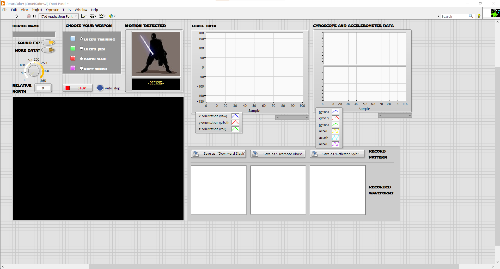

# SmartSaber

> *A LabVIEW project that virtualises hand movements captured via a smartphone's sensors, and graphically reproduces them in real time as a 3D lightsaber!* 

A long time ago in a galaxy far far away, the final assignment for my Real Time Digital Signal Processing (RT-DSP) [Uni course](https://www.di.uoa.gr/en/studies/undergraduate/303) was to create a [LabVIEW](https://www.ni.com/en-us/shop/labview.html) project that would somehow -you guessed it- capture, process and *visualise* digital signals produced in real time. 

Going through the Star Wars phase at the time, the idea was to somehow animate a  lightsaber in 3D space that would mirror one's hand movements. How? Using a smartphone, by running motion-capturing apps that would send the data to a computer to get 3D-rendered. 

Lo and behold:

==**TODO** insert video== 

In 2022 I decided to revive this gem, and open-source it to share the fun! 

The original final deliverable for the 2016 assignment can be found in the [RT-DSP Project Spec.pdf](RT-DSP Project Spec.pdf) doc but it's in ​Gr​ee​k :greece:,  so you can find most of it's content in the following sections :gb:.

You can start practicing the Jedi tradecraft in your own dojo, by following the [step-by-step guide](#Usage Instructions). 

## Features

The main feature of SmartSaber is to collect hand movement data (elevation, rotation, acceleration etc.) from the sensors on the smartphone and depict it graphically in real time, by animating a 3D model of a lightsaber.

Schematically:

Additionally, some extra features have been implemented:

* **Lightsaber Switch On/Off**

  by tapping the device's proximity sensor to enable / disable the light beam

* **Lightsaber Customisation**

  Allowing the user to choose their weapon, from a set of four iconic options:

  * Luke's Training Lightsaber
  * Luke's Jedi Lightsaber
  * Darth Maul's Lightsaber
  * Mace Windu's Lightsaber

* **Pattern Recognition**

  Allowing the Jedi Master to record three lightsaber moves which the instrument will "learn". 

  Then, when the young padawan successfully replays any of them, the program will let them know they nailed it, with visual and sound effects.

  An example "triple-threat" of moves that can be loaded to the program are:   
  
  | Downward Slash                           | Overhead Block                           | Reflector Spin                           |
  | ---------------------------------------- | ---------------------------------------- | ---------------------------------------- |
  |  |  |  |
  
  

## Usage Instructions

1. Download and Install LabVIEW from [here](https://www.ni.com/en-us/support/downloads/software-products/download.labview.html) 

   > NI, the owner of LabVIEW offers a free 1year trial of LabVIEW's Community edition, which should be more than enough for practicing this project.

2. Clone this repo

3. Double-click the `src/SmartSaber/SmartSaber.vi` file

   it should open in LabVIEW showing you this screen:

   

4. Click "Operate > Run" to start the program.

   This will activate the computer's BT adapters and populate the "Device Name" field to pair the smartphone, blocking execution until it's connected.

5. Then, on the smartphone:

   * Pair with the computer through good-old Bluetooth settings

   * Launch the AndroView app and ignore the VI download prompt

   * Connect with the computer by entering the provided device name 

6. Once the lightsaber beam appears, calibrate the relative north using the UI knob while holding the device in an upright position, until the lightsaber is oriented appropriately

   

7. Start swinging! - ***MAY THE FORCE BE WITH YOU***

## How it works

### LabVIEW: A whistle-stop tour

**L**aboratory **V**irtual **I**nstrument **E**ngineering **W**orkbench, in short "LabVIEW" is a platform distributed by [National Instruments](https://ni.com/) (NI) which allows engineers to develop applications for data-acquisition, instrument control, industrial automation and other purposes. It runs on Windows, Linux, macOS, and even on the [cloud](https://lumen.ni.com/nicif/US/EVALLVONLINE/content.xhtml)! and is highly extensible. 

LabVIEW apps are called Virtual Instruments (VIs) and are written in "G", a visual programming language. A VI, such as a simple Thermometer, consists of 2 basic components:

1. The **Block Diagram** where the developer "codes" the data-flow by arranging things like wires, gates and functions. For our thermometer app, it would look like this: 

   

   > Looks easy? Take a look at the block diagram of the SmartSaber VI, consisting of 13 custom subVIs. You'll find it [here](exports/justBlockDiagram/SmartSaberd.png). 

2. The **Front Panel** where the end-user interacts with the final "instrument" using things like dials, knobs, switches and text input fields. For our simple thermometer, it looks something like this:

   

### SmartSaber Components

On a high level, our project consists of the following components:

* A **smartphone**, collecting sensor data and transmitting to the computer over Bluetooth using the AndroView **app**

* A computer running the VI in **LabVIEW**, receiving the data in real time and rendering the animated lightsaber

  

In detail, here's what was used for a working setup, both originally and for the 2022 reboot 

| Smartphone (2016) - LG Google Nexus 5                        | Computer (2016) - HP Pavilion dv7 2030ev |
| ------------------------------------------------------------ | ---------------------------------------- |
| OS: Android 6.0 "Marshmallow"                                | OS: Windows XP (32-bit)                  |
| Bluetooth: 4.0                                               | Bluetooth: 4.0                           |
| WiFi: 802.11 a/b/g/n/ac                                      | WiFi: 802.11 b/g                         |
| USB port: micro 2.0                                          | CPU: Intel Core 2 Duo 2.40 GHz           |
| Sensors: InvenSense MPU 6515 / Parallax QTI / Avago APDS 9930 | Memory: 2 GB                             |
| "AndroView Free" version 2.4.1, downloaded from [Play Store](https://play.google.com/store/apps/details?id=com.heightdev.androviewbluetooth) 1 | Graphics Card: AMD Radeon HD 4650        |
| "Sensor Network for LabVIEW" version 1.1.2, downloaded from [Play Store](https://play.google.com/store/apps/details?id=com.heightdev.androviewbluetooth) 1 | LabVIEW version: 8.5                     |

[^1]: Application no longer available

| Smartphone (2022) - Google Pixel 2                           | Computer (2022) - Dell Precision M4600        |
| ------------------------------------------------------------ | --------------------------------------------- |
| OS: Android 11.0 "Red Velvet Cake"                           | OS: Windows 10 Pro (64-bit)                   |
| Bluetooth: 5.0                                               | Bluetooth: 4.0                                |
| WiFi: 802.11 a/b/g/n/ac                                      | WiFi: 802.11n                                 |
| USB port: micro 3.1, Type-C                                  | CPU: Intel Core i7 2.80 GHz                   |
| Sensors: OEM Accelerometer / Compass / Gyroscope / Proximity | Memory: 16 GB                                 |
| "AndroView Free" version 2.4.1, downloaded from [ApkPure](https://m.apkpure.com/androview-free-labview-vi/com.heightdev.androviewbluetooth/versions) | Graphics Card: AMD FirePro M5950 Mobility Pro |
|                                                              | LabVIEW version: 21.0                         |

### Notes on the Internals

The SmartSaber LabVIEW project (`src/SmartSaber/`) is structured as follows:

* Main VI, the project's entry-point: `SmartSaber.vi` : 

* Supporting VIs
  * `subVIs/`
  * `subVIs/sensors/` 
  * `globals/`
  
* Pattern Recognition placeholder data:
  * The raw data streams (`patterns/`)
  
  * The resulting charts for these sequences (`waveforms/`)
  
    > As all sensors (and warriors) are different, these moves were recorded back in 2016 and are only provided as placeholder values to populate the UI views. It is thus almost impossible to actually imitate them. Instead, the user is encouraged to record their own moves according to their devices and wrist flexibilities.
  
* Audiovisual FX Resources
  * `images/`
  * `sfx/`
  * `fonts/`

The VI's code revolves around 2 loops:

1. **The Main Loop:**

   ...responsible for signal processing and 3D rendering. The AndroView mobile application continuously captures sensor data and encodes them in a byte stream, which is sent to the computer over Bluetooth on regular intervals. The stream has the following format:

   `...yXXz`**`aXXbXXcXXdXX...wXXxXXyXXz`**`aXXb...`

   Each lowercase letter matches to a sensor and the XX part following (of varying length) holds the respective value read, according to this matrix: 

   | a       | b       | c       | ...  | f     | g     | h     | ...  | o         | p        | q      | r      | s      | ...  |
   | ------- | ------- | ------- | ---- | ----- | ----- | ----- | ---- | --------- | -------- | ------ | ------ | ------ | ---- |
   | accel_x | accel_y | accel_z |      | ori_x | ori_y | ori_z |      | prox_dist | prox_max | gyro_x | gyro_y | gyro_z |      |

   This project only leverages the following sensors:

   * Orientation vector
   * Level Data
   * Gyroscopes
   * Accelerometers
   * Proximity Sensors

   > Ellipsis (...) values are of no interest to our project and involves other irrelevant sensors such as the thermometer, magnet, pressure-sensor etc.   

   The motion sensor data-stream received is also continuously plotted in the Front Panel in scrolling charts for all X, Y and Z axes.

   

   The main loop is also responsible for detecting the recorded patterns,  by continuously checking the received byte stream of a fixed time window, and comparing it point-to-point with all three recorded waveforms (tolerant to a certain error margin)

2. **The Event-Handling Loop**

   This is purely responsible for the UI buttons corresponding to the move record feature, which allow the user to save their motion of a certain time window.   

The program can be fully stopped through the "Operate > Stop" button in the LabVIEW menus. When the Bluetooth connection with the device is lost the program doesn't fully stop but the processing loop is ceased, lighting the blue "Auto-stop" indicator. 

## Future Work

> Both original TODOs envisioned from 2016 and fresh ones from the 2022 reboot.

- [ ] Replace that horrible, 8bit-looking icon 

- [ ] Change 3D Background to a picture of the galaxy far far Away

  Maybe need to do this [programmatically](https://knowledge.ni.com/KnowledgeArticleDetails?id=kA00Z000000kHejSAE&l=en-GR)

  Re-replace screenshots

- [ ] Star Wars fonts ("Star Jedi") as in the original project (and replace screenshots)

  Need to include them in the installer, so that the user doesn't have to manually install them to their system

- [ ] investigate if it's possible to use "LabVIEW Online" to quick-demo the project

- [ ] Lightsaber handle decals, not just beam ones

- [ ] Code your own client app?

- [ ] Create Installer and EXE app to abstract LabVIEW details.

